# Image Segmentation
__Anish Sachdeva (DTU/2K16/MC/013)__

## Overview
1. [Introduction](#introduction)
1. [Running It On Your Machine](#running-it-on-your-machine)
1. [API](#api)
1. [Examples](#examples)

## Introduction
Performing image segmentation using the Augmenting Path Algorithm.

## Running It On Your Machine
Clone this repository and enter project directory.
````bash
git clone https://github.com/anishLearnsToCode/image-segmentation.git
cd image-segmentation
````

Install all dependencies using _pip_.
```bash
pip install -r requirements.txt
```

Now, run the program with any image of your choice. (You can also try any of the given examples 
present in the images directory just to get started).
```bash
python imagesegmentation.py images/test1/test1.jpg
```

A new window will pop up showing your image. Use your cursor to mark object seeds, which would 
be shown in red. Once you're done, press `esc`. Then do the same to mark background seeds, 
which would be shown in green.

## API 
You can pass in any image in the program to perform segmentation.
```bash
python imagesegmentation.py relative_path_to_image_file
``` 

By default it will convert every image to 30x30 px, but you can change that by passing in the 
`--size` argument as so.
```bash
python imagesegmentation.py images/baby/baby.jpg --size=50
```
> Warning ⚠ The algorithm has quadratic time complexity so increasing image size by even a small
> factor may adversely affect performance.

## Examples

1. `test1.jpg` 

Original, seeded, and segmented image

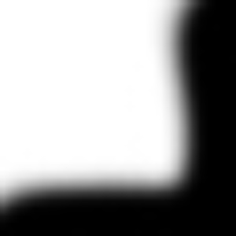 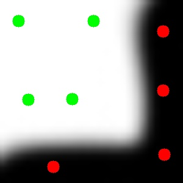 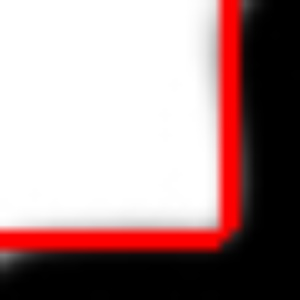

2. `test2.jpg`

Original, seeded, and segmented image

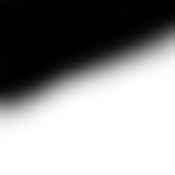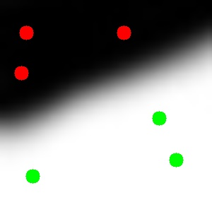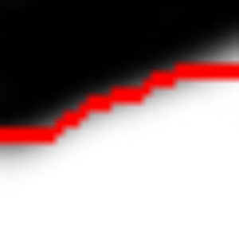

3. `test3.jpg`

Original, seeded, and segmented image

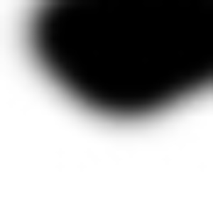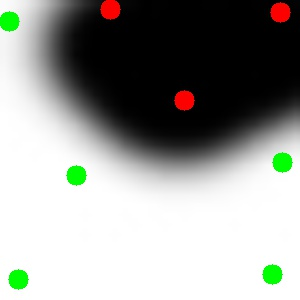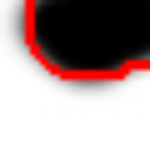


4. `baby.jpg`

Original, seeded, and segmented image

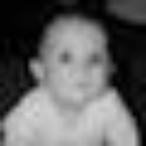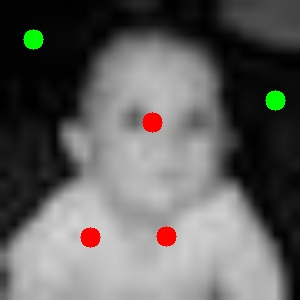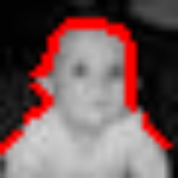
